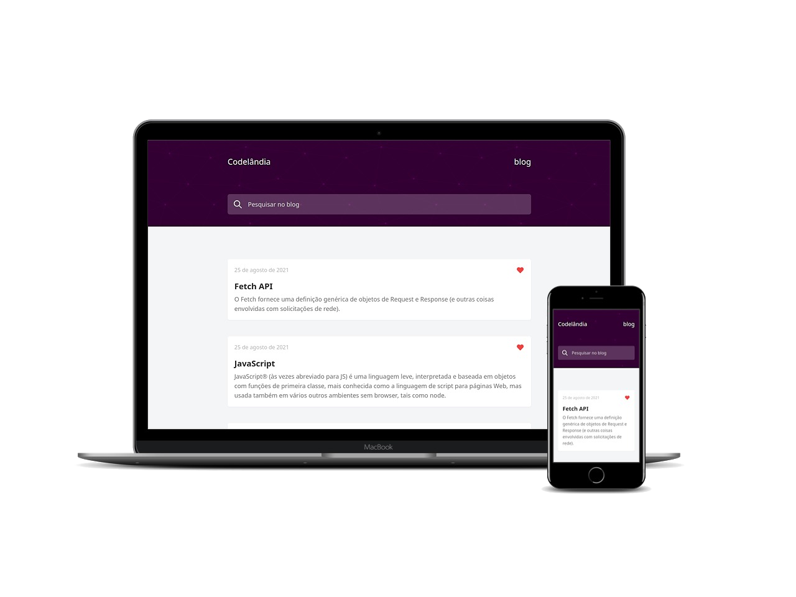

# Codelândia Blog

  
  
  
  
  

## Tópicos 

[Sobre o Desafio](#sobre-o-desafio)

[Tecnologias](#tecnologias)

[Licença](#licença)

 

## Sobre o Desafio

Desafio #1 da comunidade Codelândia, by [Iuri Silva](https://github.com/iuricode).
O desafio consiste em construir um blog de acordo com o layout disponibilizado.

 

  

## Tecnologias

As seguintes tecnologias foram utilizadas no desenvolvimento do projeto:

- [TypeScript](https://www.typescriptlang.org/)
- [Next.js](https://nextjs.org/)
- [Tailwind](https://tailwindcss.com/)
- [GraphQL](https://graphql.org/)
- [graphql-request](https://github.com/prisma-labs/graphql-request)
- [GraphQL code generator](https://www.graphql-code-generator.com/)

 

## Licença

 

Esse projeto está sob a licença MIT. Veja o arquivo [LICENSE](/LICENSE) para mais detalhes.

---

Feito com :heart: by [Rafael Martins](https://github.com/martins-rafael)
